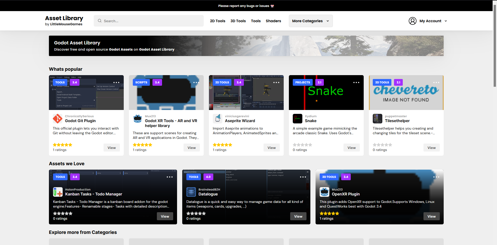

# Godot Asset Library



**What is this:**
An Open Source (AGPLv3) Godot Asset Library

Features:
* Asset mirroring from the default library
* Asset review and rating system
* User accounts with bookmarking
* Open Source 😎
  
## Running
### Docker based envrionment
Run:
```
docker compose up -d --build
```

For local development with source watching:
```
docker compose -f docker-compose.yml -f docker-compose.dev.yml up -d --build
```

To tail nodejs:
```
docker logs nodejs -f
```

### Non docker based development:
```
npm run devel
```

For linting:
```
npm run lint:check
```

### Verification
```
npm run typecheck      # TypeScript validation (use this, not `build`, for types)
npm run lint:check     # ESLint enforcement (npm run lint exits 0 by design)
npm test               # Compiles and runs the node:test suite (host Node 18+)
npm run build          # Webpack bundle + per-page Sass
```

### Indexes & migrations
Search relies on MongoDB text search and several derived fields. Migrations
are applied with a single command (they record completion in the `migrations`
collection, so they are idempotent):
```
npm run migrate
```
Migrations create/verify:
* `0001` — the weighted text index (`title` 10, `quick_description` 7, `author` 7, `description` 1). MongoDB only allows one text index per collection, so a conflicting legacy index must be dropped manually first.
* `0002` — backfills the confidence-adjusted `rating_score` (95% Wilson lower bound) used by "Highest rated" sorting.
* `0003` — backfills the normalized `modify_date_at` used by "Recently updated" sorting.
* `0004` — deduplicates reviews by `(user_id, asset_id)` and creates the unique index.

Operational maintenance (run against a snapshot first):
```
npm run reconcile:ratings   # Recompute vote counters + rating_score from reviews
npm run audit:catalog       # Read-only catalog health audit
```

## Folder Structure
```
 src
  └───backend             # Backend / dynamic 
    │   RouterServer.ts   # Start our router
    │   MongoHelper.ts    # Our MongoDB helper
    │   start.ts          # App entry point
    └───components        # Reusuable eta.js templates
    └───modules           # Each site module (ex, admin area, blog area, etc) 
      └─── ModuleName     # Module Example
        │───controllers   # Module controllers
        │───jobs          # Cron / scheduled jobs
        │───models        # Database models
        │───services      # All the business logic
        │───views         # Store the Views for the module (eta.js templates)
    └───utility           # All our utility classes, like loggers
  └───frontend            # Frontend assets (ex pre-compiled or static)

```

**Controllers**
Controllers do not handle business logic. They interpret routes, call our services and return the data

**Services**
Services handle all our buisness logic

**Models**
Our DB models

**Jobs**
Spot to put cron jobs or other scheduled jobs

**Views**
Our ETA templates and relevant SCSS for the page

## Style guide
All functions will have a `DocBlock` to describe its purpose
```js
/**
* Short function description
*/
function name () {
  ...
}
```

All functions will be static typed
```js
/**
* Print name and age to console
*/
function name (name: string, age: number): void {
  console.log(name, age)
}
```

All functions will have full docblocks ( for API generation and editor hints )
```js
/**
* Print name and age to console
* 
* @param {string} name the users name
* @param {number} age the users age
* @returns {void}
*/
function name (name: string, age: number): void {
  console.log(name, age)
}
```

Filenames to match class names
```js
// GetCoffee.ts
export class GetCoffee {
  ...
}
```

## Code guide
* Models can (and should!) throw errors
* Following TS Standard (as best as resonably possible)
